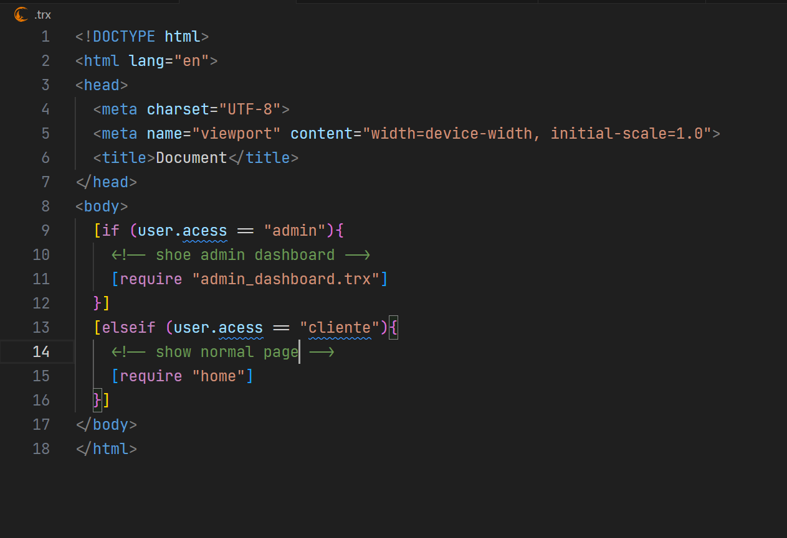
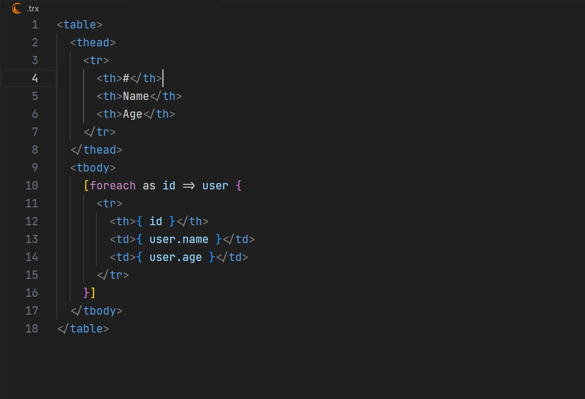

# TrixyTPL

**TrixyTPL** — Highlight e snippets para a linguagem de templates *TrixyTPL*.

Resumo: traz destaque de sintaxe (injeção no HTML), snippets úteis e integração com Emmet/formatter HTML.

---

## Componentes

* Grammar (TextMate) que injeta destaque dentro de arquivos HTML.
* Snippets para `for`, `foreach`, `if/elseif/else`, `require` e `str_filter`.
* Configuração padrão (via `configurationDefaults`) que associa `.phtml/.trixy/.tpl` à sua linguagem, ativa Emmet e seta o formatador HTML como default para arquivos TrixyTPL.
* Ícone simples em `icons/`.

---

## Como usar

* Abra arquivos com extensão `.trixy`, `.tpl` ou `.trx`. A extensão faz a associação automaticamente.
* Snippets: digite o `prefix` (ex.: `for`, `foreach`, `if`, `require`, `str_filter`) e confirme a sugestão.
* Emmet funciona dentro do TrixyTPL porque `emmet.includeLanguages` está configurado para mapear `trixytpl` → `html`.
* O formatter padrão para `trixytpl` é o `vscode.html-language-features` (HTML formatter). Se você usa outro formatter, configure no workspace.

---

## Demonstração

| Condicionais | Loops em tabelas |
|------------|-----------|
|  |  |

---

## Troubleshooting rápido

* Se highlight não aparecer: reinicie (Reload Window) e use `Developer: Inspect TM Scopes` para checar scopes.
* Se snippets não aparecerem: confirme que o arquivo está com language id `trixytpl` (canto inferior direito) ou que você adicionou `"language": "trixytpl"` ao package.json snippets.
* Se aparecer `multiple formatters` ou algo sobre formatter: a extensão tenta definir o formatter padrão; se houver conflito, o usuário pode sobrescrever via `settings.json`.

---

## Contribuição

Contribuições são bem-vindas. Faça fork, crie branch com mudanças claras e abra pull request. Siga estas dicas:

* Teste a grammar com `Developer: Inspect TM Scopes`.
* Mantenha `snippets/` limpos e com placeholders legíveis.
* Atualize `CHANGELOG.md` e incremente versão no `package.json`.

---

## Arquivos importantes

* `package.json` — metadados e contribs
* `syntaxes/trixytpl.tmLanguage.json` — grammar (TextMate)
* `snippets/trixytpl.json` — snippets JSON
* `icons/` — ícone(s)
* `language-config.json` — comentários, auto-closing, etc.

---

## Licença

```
License: Apache 2.0
```